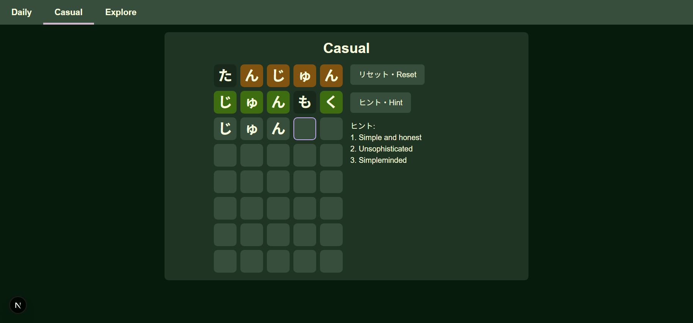
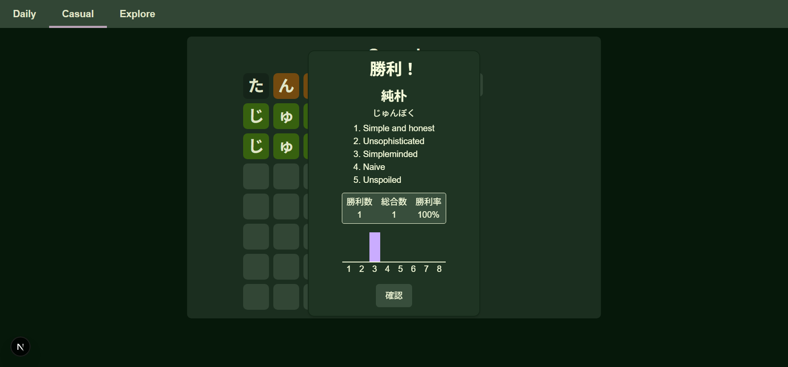
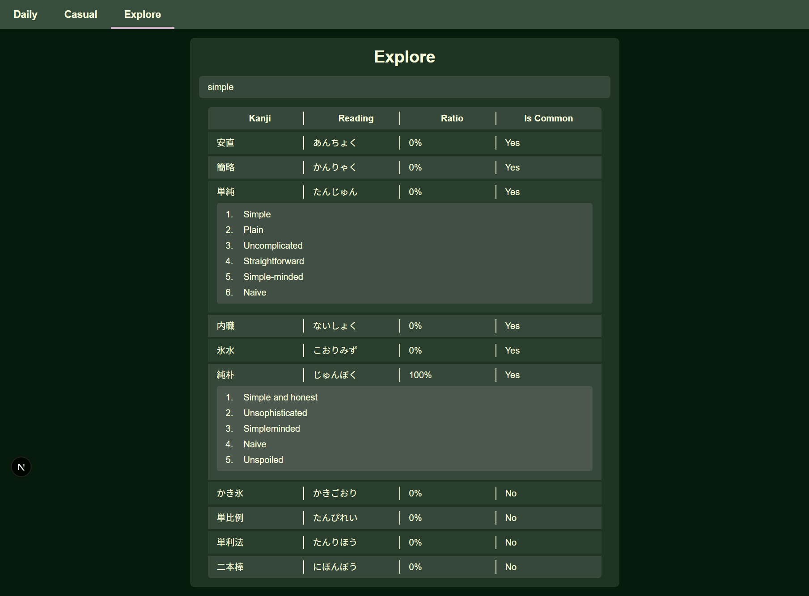

# YSN - シンプルなWordleの真似
日本語版の[Wordle](https://www.nytimes.com/games/wordle/index.html)の真似です。
デイリーとカジュアル（いつでもできる）モードがあります。
意味・読み方・漢字を検索できます。


## スクリーンショット
### メイン画面



### 検索画面


## 機能
- デイリー（リセットされるまで一つの言葉）
- カジュアル（自由でリセット可能）
- 言葉検索（英字・ひらがな・カタカナ・感じ）

> [!NOTE]
> デイリーは追加の設定が必要です。
> `src/app/api/word/reset/route.tsx`と`scripts/reset_word.sh`を見てください。
> Cronなど定期的にタスクを実行できるものは必要。

## 技術
- Next.js（フルスタック）
- Sqlite
- Python（データの前処理とデータベースの生成）

## 準備
Nodeパッケージをインストール
```
pnpm install
```

データベースを作る
```
./setup.sh
```
> [!IMPORTANT]
> 前処理はPythonが必要です

## 開発環境で実行
```
pnpm run dev
```
